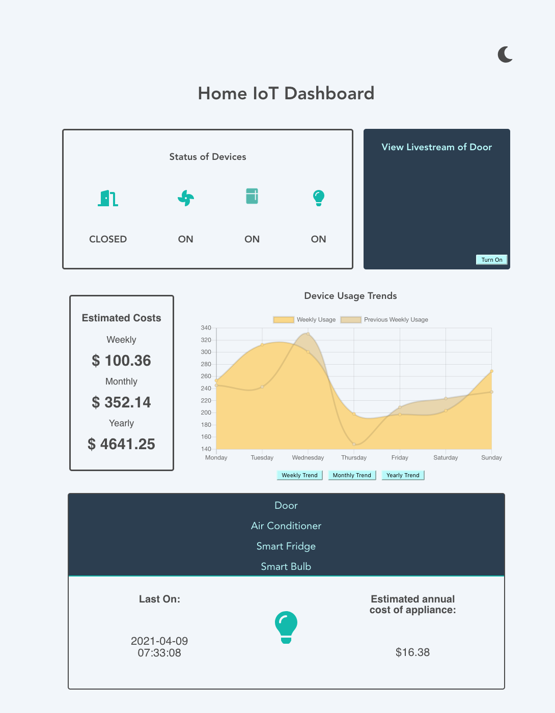
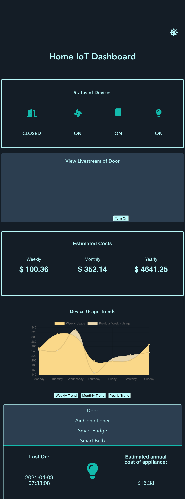
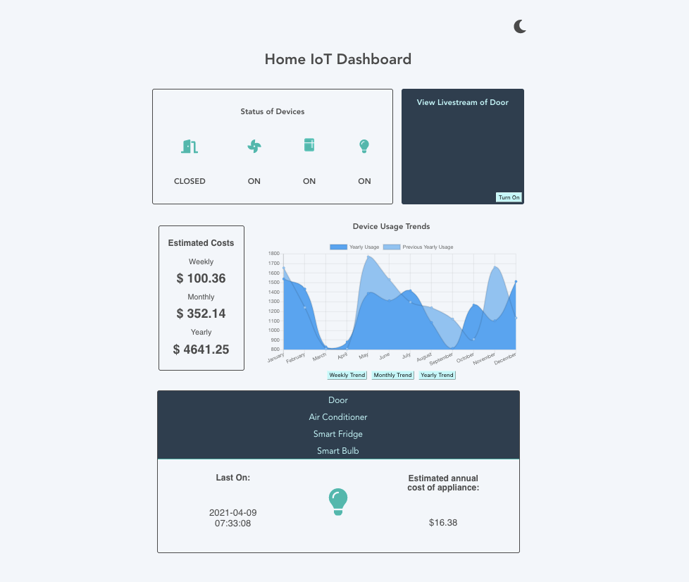
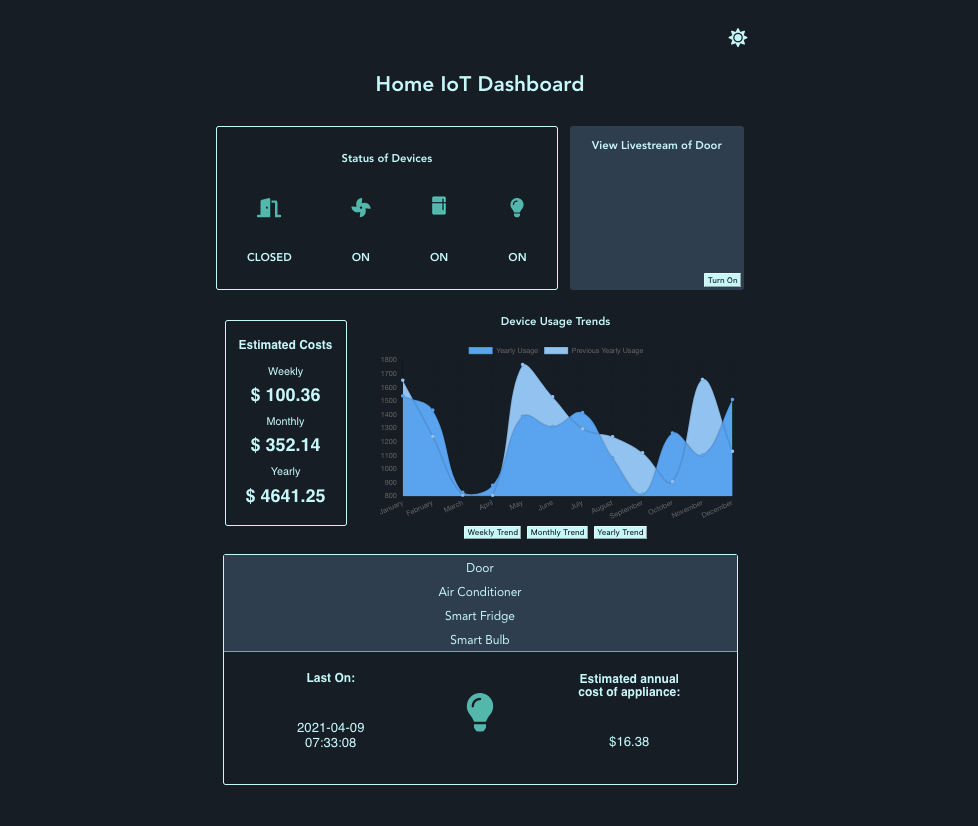
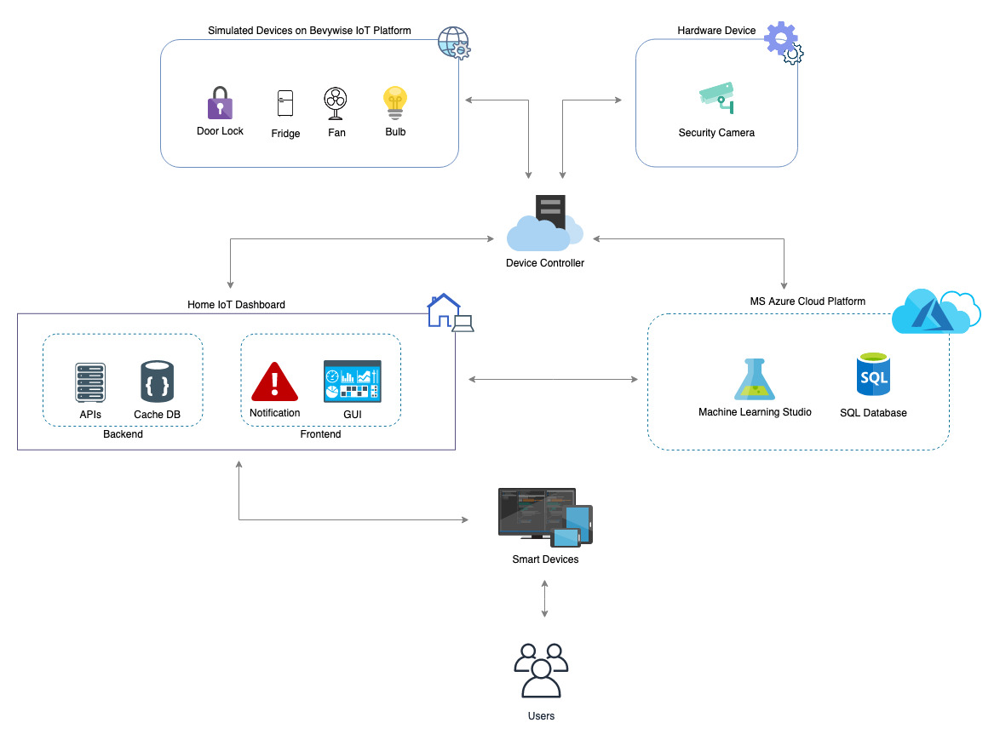

# iotDashboard

### Overview of the Application

The *Home IoT Dashboard* is an interactive browser based application for our *Home IoT Network.* This network was created for our final year Capstone project. The dashboard gives greater monitoring, control, and security features for the user's smarthome devices from a unified browser based application. The dashboard app allows users to interact with the network in real time through their computer, tablet, or smart phone devices both locally and outside of the network.

The backend of the Dashboard connects to MS Azure ML and Azure SQL Database for big data archival and cloud computing. The Dashboard also connects directly with the Device Controller to operate the smarthome devices when the user is in the local IoT Home Network.

The following features are included in the dashboard:

* Status of Devices
* Livestream Video of Door
* Estimated Costs
* Device Usage Trends
* Device Summary
* Light/Dark Theme Switch
* Notification Banner

#### Screenshots of the Home IoT Dashboard

The *Home IoT Dashboard* is a browser based application that can be used on any smart device including computers, tablets, and smartphones. The app's responsive design adjusts for different sized screens, and the light/dark themes allows users to comfortably use the dashboard during night hours.

|Dashboard on Monitors (large device)|Dashboard on Mobile (small device)|
|:----------:|:--------:|
|||

|Light Mode|Dark Mode|
|:----------:|:--------:|
|||

### Overview of the Network

This network is a distributed system with data processing and storage done in MS Azure's Cloud Platform allowing for big data processing and archival.

The initial flow of data starts from the simulated smarthome devices which are routed to the cloud and dashboard through the Device Controller. The raw data is archived in Azure SQL Database, then used in machine learning models in Azure ML, and stored as processed data in another table in Azure SQL Database.

The Dashboard application has a local cache database in the backend that fetches data from the cloud database weekly during low network traffic hours and stores the main processed information in the app. This minimizes the latency of the dashboard and allows application functionality while offline. All data insights and device information are presented to the user on the dashboard's front end.

|High Level Design of Network|
|:----:|
||

### Home IoT Network's Main Tech Stack

* Bevywise IoT Simulator (smarthome devices)
* Bevywise MQTT Broker (device controller)
* laptop camera (security camera device)

* Linux Virtual Machine (home environment)
* Apache Tomcat Local Server (controller in home environment)

* Vue.js
* Node
* JSON (cache DB)
* Mocha and Chai (testing)
* WebRTC

* MS Azure Machine Learning
* MS Azure SQL Database

* Firefox Dev Tools

### Network Performance

The following metrics show the overall latency of using the network to load the dashboard application for the first time. This was tested with throttled internet and emptied browser cache to show the worst case loading speeds.

|Request Type|Avg Latency|Notes|
|----------|----------|--------|
|Dashboard Loading on WiFi|4.8s|Without previous browser cache|
|Dashboard Loading on 4G/LTE|36.0s|Without previous browser cache|
|Weekly Data Fetch Cycle|8364 ms|Includes data fetching from cloud server, backend calculation, write out to cache database|
